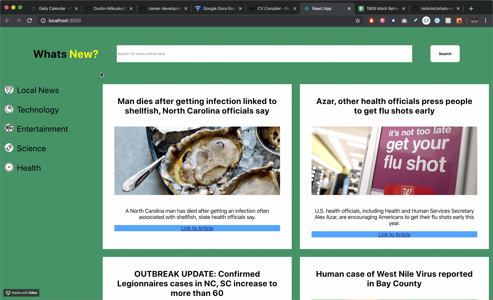
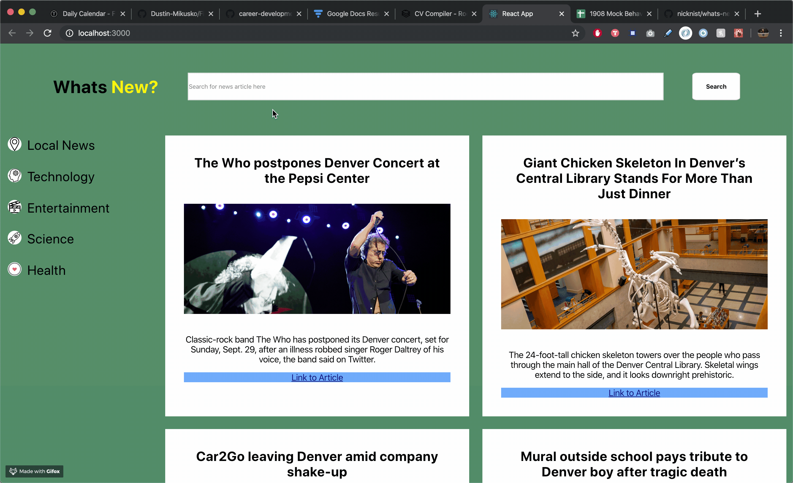

# What's New?

## Project Overview:

What's new is all about staying updated on the latest news. There's a few categories to look for and you can also search based on the page that you're on!

This is the first project that I've used React and am learning class-based components for now. I hope to use hooks in the future and learn redux as well.

## Running the Program:

* Pull this repo down, run npm install, run npm start, and then open a new tab with the 'localhost' that the server is running.

## Wins:

* This project was my first deep dive into React. Using components and class based React was really enjoyable and made life a lot easier versus using vanilla JavaScript
* Implementing testing with React was different than when I've used Mocha and Chai. Jest was fun to learn and easy to implement once I read some documentation and understood how to use it.

## Working Demo:
### Menu Navigation:

### Search Button:

### Collaborators:

[Nick Nist](https://github.com/nicknist)
